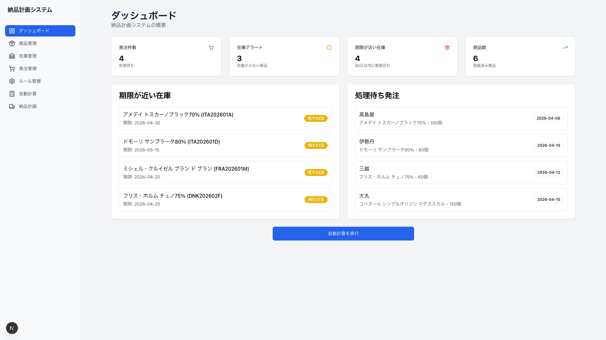
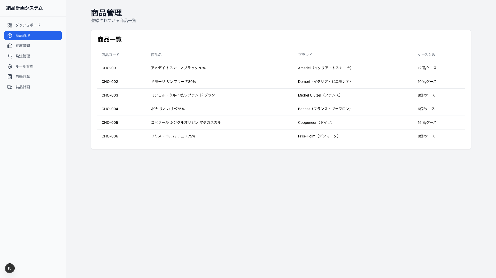
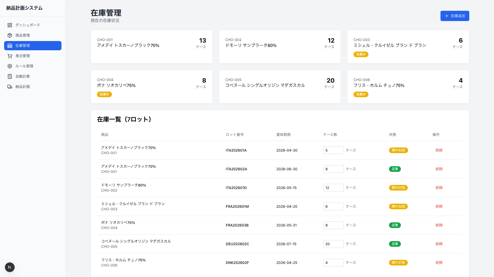
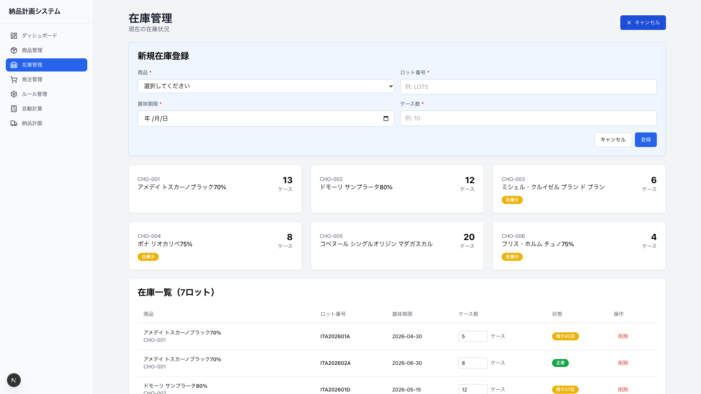
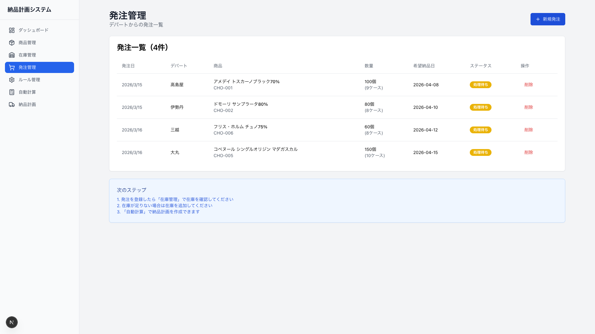
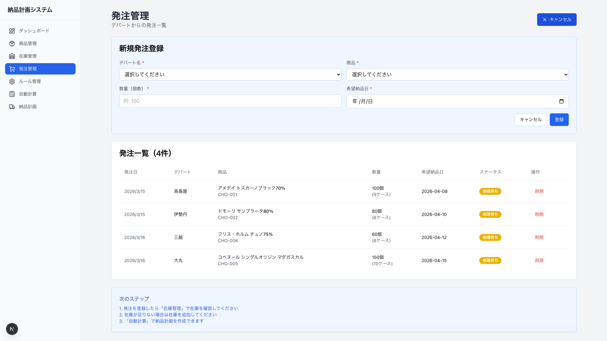
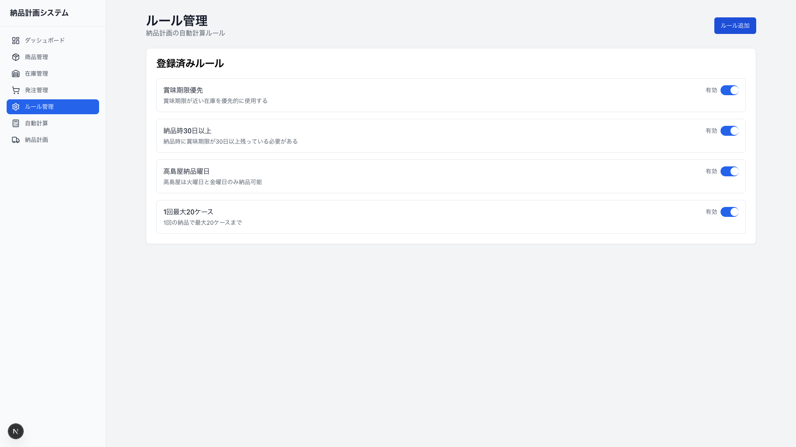
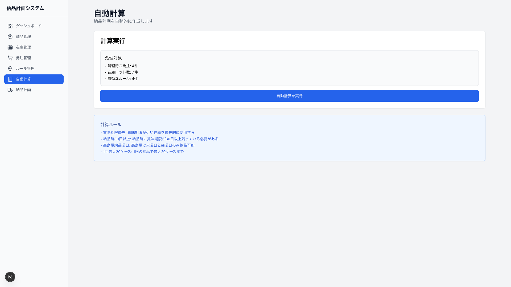
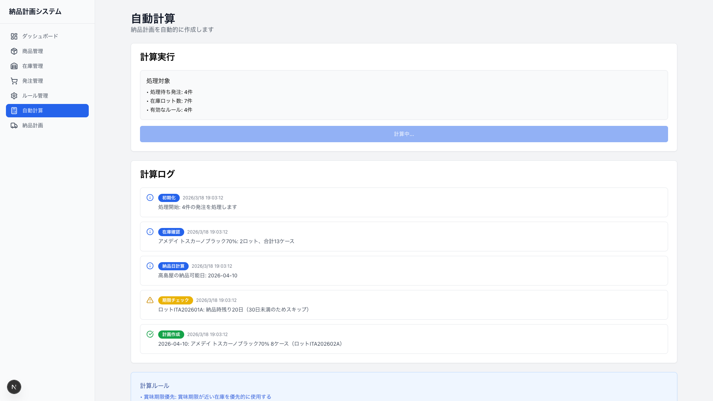
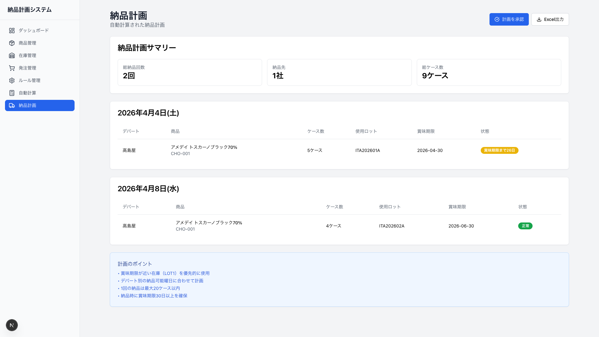

# 海外高級チョコレート納品計画システム 使い方ガイド

このシステムは、デパートからの発注に対して、在庫と賞味期限を考慮した最適な納品計画を自動的に作成します。

## 🍫 対応商品

以下の海外輸入高級チョコレートブランドに対応しています：

- **Amedei（アメデイ）** - イタリア・トスカーナ
- **Domori（ドモーリ）** - イタリア・ピエモンテ
- **Michel Cluizel（ミシェル・クルイゼル）** - フランス
- **Bonnat（ボナ）** - フランス・ヴォワロン
- **Coppeneur（コペヌール）** - ドイツ
- **Friis-Holm（フリス・ホルム）** - デンマーク

---

## 📖 目次

1. [基本的な使い方](#基本的な使い方)
2. [画面ごとの操作方法](#画面ごとの操作方法)
3. [実際の業務例](#実際の業務例)

---

## 基本的な使い方

### 業務の流れ（5ステップ）

```
① 発注登録 → ② 在庫確認 → ③ 自動計算 → ④ 計画確認 → ⑤ 承認
```

#### ① 発注登録
デパートから受けた発注を「発注管理」画面で登録します。

#### ② 在庫確認
「在庫管理」画面で在庫が足りるか確認し、不足している場合は追加します。

#### ③ 自動計算
「自動計算」画面で納品計画を自動作成します。

#### ④ 計画確認
「納品計画」画面で作成された計画を確認します。

#### ⑤ 承認
内容に問題がなければ計画を承認し、Excel出力します。

---

## 画面ごとの操作方法

### 1. ダッシュボード



システム全体の状況を一目で確認できます。

**表示される情報**:

| 項目 | 内容 |
|------|------|
| **発注件数** | まだ処理していない発注の数 |
| **在庫アラート** | 10ケース未満の商品数 |
| **期限が近い在庫** | 60日以内に賞味期限が切れる在庫 |
| **商品数** | 取り扱い商品の総数 |

---

### 2. 商品管理



取り扱い商品の一覧を確認できます。

**表示される情報**:
- 商品コード（例：CHO-001）
- 商品名
- ブランド名
- 1ケースあたりの入数

---

### 3. 在庫管理



在庫の確認、追加、ケース数の変更、削除ができます。

#### 在庫の状態表示

| 色 | 意味 | 期限 |
|----|------|------|
| 🟢 緑 | 正常 | 61日以上 |
| 🟡 黄 | 注意 | 31-60日 |
| 🔴 赤 | 警告 | 30日以内 |

#### 在庫を追加する



**手順**:
1. 「在庫追加」ボタンをクリック
2. 以下を入力：
   - **商品**: プルダウンから選択
   - **ロット番号**: 入荷した商品のロット番号を入力
   - **賞味期限**: カレンダーから選択
   - **ケース数**: 入荷したケース数を入力
3. 「登録」ボタンをクリック

#### ケース数を変更する

在庫一覧テーブルのケース数欄に直接数字を入力すると、すぐに反映されます。

#### 在庫を削除する

各行の「削除」ボタンをクリックし、確認ダイアログで「OK」を選択します。

---

### 4. 発注管理



デパートからの発注を登録・確認できます。

#### ステータスの意味

| ステータス | 色 | 意味 |
|-----------|-----|------|
| **処理待ち** | 🟡 黄 | まだ納品計画を作成していない |
| **処理中** | 🔵 青 | 計算実行済み、計画作成中 |
| **完了** | 🟢 緑 | 計画承認済み |

#### 発注を登録する



**手順**:
1. 「新規発注」ボタンをクリック
2. 以下を入力：
   - **デパート名**: プルダウンから選択（高島屋、伊勢丹、三越、大丸、松坂屋）
   - **商品**: プルダウンから選択
   - **数量**: 発注された個数を入力
   - **希望納品日**: カレンダーから選択
3. 「登録」ボタンをクリック

#### 発注を削除する

**処理待ち**状態の発注のみ削除できます。「削除」ボタンをクリックし、確認ダイアログで「OK」を選択します。

---

### 5. ルール管理



納品計画の作成ルールを確認・設定できます。

#### 標準ルール

| ルール名 | 内容 |
|---------|------|
| **賞味期限優先** | 期限が近い在庫から優先的に使用 |
| **納品時30日以上** | 納品時に賞味期限が30日以上必要 |
| **高島屋納品曜日** | 高島屋は火曜日と金曜日のみ納品可能 |
| **1回最大20ケース** | 1回の納品は最大20ケースまで |

#### ルールの有効/無効を切り替える

各ルールのスイッチをクリックすると、有効・無効を切り替えられます。
- **オン（青）**: ルールが有効
- **オフ（灰）**: ルールが無効

#### 新しいルールを追加する

1. 「ルール追加」ボタンをクリック
2. ルール名と説明を入力
3. 「追加」ボタンをクリック

**注意**: デモ版では、追加したルールは表示のみで、実際の計算には反映されません。

---

### 6. 自動計算



発注と在庫を基に、最適な納品計画を自動的に作成します。

#### 計算を実行する

**手順**:
1. 処理対象を確認（処理待ち発注、在庫ロット数、有効なルール）
2. 「自動計算を実行」ボタンをクリック
3. 計算ログを確認



#### 計算ログの見方

| アイコン | 意味 |
|---------|------|
| 🔵 | 情報：処理の進行状況 |
| 🟡 | 警告：注意が必要な状況 |
| 🟢 | 成功：処理が完了 |
| 🔴 | エラー：問題が発生 |

#### 計算で行われること

1. **在庫確認**: 商品ごとの在庫を確認
2. **在庫不足チェック**: 発注に対して在庫が足りるか確認
3. **納品日計算**: デパート別の納品可能曜日を考慮
4. **期限チェック**: 賞味期限30日以上の条件を確認
5. **計画作成**: ロットを割り当てて計画を生成

#### 完了後

「納品計画を確認」ボタンが表示されたら、クリックして計画画面へ移動します。

---

### 7. 納品計画



自動作成された納品計画を確認・承認できます。

#### 納品計画サマリー

- 総納品回数
- 納品先の数
- 総ケース数

#### 日付別の計画

各納品日ごとに以下が表示されます：
- 納品日（曜日付き）
- デパート名
- 商品名
- ケース数
- 使用するロット番号
- 賞味期限
- 状態（警告/正常）

#### 計画を承認する

**手順**:
1. 計画内容を確認
2. 問題がなければ「計画を承認」ボタンをクリック
3. 確認ダイアログで「OK」をクリック
4. 承認完了メッセージが表示されます

#### Excel出力する

1. 「Excel出力」ボタンをクリック
2. デモメッセージが表示されます

**注意**: デモ版ではExcelファイルは実際には生成されません。本番版では実際のファイルがダウンロードされます。

---

## 実際の業務例

### 例1: 高島屋から「アメデイ トスカーノブラック70% 100個」の発注

#### 状況
- **発注元**: 高島屋（母の日ギフトコーナー）
- **商品**: アメデイ トスカーノブラック70%
- **数量**: 100個
- **希望納品日**: 2026年4月8日

#### 対応手順

**1. 発注を登録する**
- 発注管理画面で「新規発注」をクリック
- デパート: 高島屋
- 商品: CHO-001 - アメデイ トスカーノブラック70%
- 数量: 100
- 希望納品日: 2026-04-08
- 「登録」をクリック

**2. 在庫を確認する**
- 在庫管理画面を開く
- アメデイ トスカーノブラック70%の在庫を確認
- 必要ケース数: 100個 ÷ 12個/ケース = 9ケース
- 現在の在庫: 13ケース → ✅ 在庫十分

**3. 自動計算を実行する**
- 自動計算画面を開く
- 「自動計算を実行」をクリック
- ログで処理状況を確認

**4. 計画を確認する**
- 納品計画画面を開く
- 以下の計画が作成されました：
  - **1回目（4月4日金曜）**: 5ケース（ロットITA202601A）
  - **2回目（4月8日火曜）**: 4ケース（ロットITA202602A）
- 理由: 期限が近いロットから優先的に使用

**5. 計画を承認する**
- 内容を確認
- 「計画を承認」をクリック
- Excel出力で配送指示書を作成

---

### 例2: 在庫が不足している場合

#### 状況
- **発注元**: 伊勢丹
- **商品**: ドモーリ サンプラータ80%
- **数量**: 150個
- **現在の在庫**: 12ケース（不足3ケース）

#### 対応手順

**1. 発注を登録する**
- 通常どおり発注を登録

**2. 在庫不足を確認する**
- 在庫管理画面で在庫を確認
- 必要: 15ケース
- 現在: 12ケース
- → ❌ 3ケース不足

**3. 在庫を追加する**
- 「在庫追加」をクリック
- 商品: CHO-002
- ロット番号: LOT5（新しい入荷分）
- 賞味期限: 2026-07-31
- ケース数: 5
- 「登録」をクリック

**4. 再確認する**
- 総在庫: 12 + 5 = 17ケース
- → ✅ 在庫十分

**5. 自動計算を実行する**
- 正常に計画が作成されます

---

### 例3: 大量発注で分割納品が必要な場合

#### 状況
- **発注元**: 三越
- **商品**: ミシェル・クルイゼル ブラン ド ブラン
- **数量**: 200個
- **必要ケース数**: 25ケース
- **制約**: 1回の納品は最大20ケースまで

#### 自動計算の結果
```
計画1: 2026-04-10（水曜日）20ケース
計画2: 2026-04-13（土曜日）5ケース
```

- 三越の納品可能曜日（水・土）に合わせて自動分割
- 最大20ケースのルールを遵守

---

## デパート別の納品曜日

| デパート | 納品可能曜日 |
|---------|-------------|
| 高島屋 | 火曜・金曜 |
| 伊勢丹 | 月曜・木曜 |
| 三越 | 水曜・土曜 |
| 大丸 | 月・水・金 |
| 松坂屋 | 火曜・木曜 |

---

## このシステムでできること

✅ 発注から納品までの流れを自動化
✅ 賞味期限を考慮した在庫の最適利用
✅ デパート別のルールに従った納品計画
✅ 手作業によるミスを削減
✅ 計画作成の時間を大幅短縮

---

**ご不明な点がございましたら、お気軽にお問い合わせください。**
